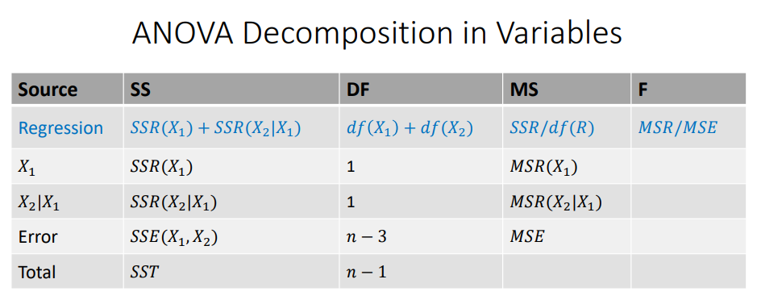

# Multiple Regression & Brand Preference Dataset

### Setting up our workspace

```{r, collapse = TRUE, warning = FALSE, message = FALSE}
library(nortest)
library(olsrr)
library(car)
library(lmtest)
library(MASS)
library(tidyverse)

setwd("C:/Users/RUMIL/Desktop/APU/STAT 511 - Millie Mao (Applied Regression Analysis)/Week 10/Week 10")

brand_data = read.table(file = "Brand.txt", header = FALSE, sep = "")

View(brand_data)

# #Adding headers
names(brand_data) <- c("Rating", "Moisture", "Sweetness")

# names(bank_data) <- c("", "")

#Defining dependent and independent vars
Rating = brand_data$Rating #Y
Moisture = brand_data$Moisture #X1
Sweetness = brand_data$Sweetness #X2
```

| Response Variable (Y)             | Explanatory Variable 1 ($X_{1}$)             | Explanatory Variable 2 ($X_{2}$)        |
|-----------------------------------|----------------------------------------------|-----------------------------------------|
| "Rating" = Degree of Brand liking | "Moisture" = Moisture content of the product | "Sweetness" = Sweetness of the product. |
|                                   |                                              |                                         |

## 1a. Fit a multiple regression model to this dataset. Write down the estimated regression function.

```{r}
#Regressing Rating (response) on Moisture (explanatory) and Sweetness (explanatory).
#Then summarizing our model
brand_lm <- lm(Rating ~ Moisture + Sweetness, data = brand_data)
summary(brand_lm)

```

From summarizing our multiple linear regression model we can see:

**Intercept**

$\beta_{0}$ = 37.6500

**Moisture (Predictor Variable):**

$\beta_{1}$ = 4.4250 *(partial slope)*

**Sweetness (Predictor Variable):**

$\beta_{2}$ = 4.3750 *(partial slope)*

and the estimated regression equation to be:

$\hat{Y}= 37.6500 + 4.4250X + 4.3750X$

## 1b. Interpret the regression coefficients $\hat{\beta_0}$ , $\hat{\beta_1}$, $\hat{\beta_2}$ in words.

### Interpretation of $\hat{\beta_0} = 37.6500$

The intercept $\hat{\beta_0} = 37.6500$ tells us when both explanatory variables, Moisture and Sweetness are at 0, then the our response variable Rating will be at 37.65.

In other words, when both moisture and sweetness are at 0, our brand rating is 37.65%

Assuming our product might have other features, then a rating (intercept) of 37.65 is very much possible and not entirely unrealistic. Although in this scenario, the usefulness of the intercept alone is not very helpful.

### Interpretation of $\hat{\beta_1} = 4.4250$

**The partial slope** $\hat{\beta_1} = 4.4250$ indicates that when holding our other explanatory variable (Sweetness) constant and unchanged, when Moisture increases by 1 unit, we can expect our rating to also increase by 4.425 rating units.

### Interpretation of $\hat{\beta_2} = 4.3750$

**Similarly, when The partial slope** $\hat{\beta_2} = 4.3750$ indicates that when holding our other explanatory variable (Moisture) constant and unchanged, when Sweetness increases by 1 unit, we can expect our rating to also increase by 4.3750 rating units.

## 1c. Test if **each of each of the two predictors** (partial slopes) in this regression are significant. Write down the null and alternative hypotheses, decision rule, and conclusion.

### Testing for Individual Paramter Significance Using t-test and p-value

**Null Hypothesis**: ${H_0}$: $\beta_{j} = 0$ (slopes are showing no change), $X_{j}$ **is not** linearly associated with Y, therefore the partial slope is not significant.

**Alternative Hypothesis**: ${H_1}$: $\beta_{j} \neq 0$ (slopes are showing change), $X_{j}$ **is** linearly associated with Y, therefore the partial slope is significant.

#### Testing the significance of Moisture ($\hat{\beta_1} = 4.4250$)

```{r}
#**We can use the qt() to find our critical value and compare with our t-value (test statistic)
# We use 0.95 Because of our **95% confidence interval
qt(0.95, 13)

```

\*\* review on examples when to use two sided tests and to set qt at 0.975 with alpha at 0.05

**t-test:**

We see that because the absolute value of our critical value (1.8317) is less than our t-value (14.695) for Moisture, we **fail to reject** our NULL hypothesis and conclude with our alternative hypothesis, that there our partial slope, **Moisture**, shows overall significance in our model.

**p-value:**

Additionally, because the p-value for Moisture is 1.78e-09 and is less than our alpha (accepted error/significance level) of 0.05 we **fail to reject** our NULL hypothesis and conclude with our alternative hypothesis, that there our partial slope, **Moisture**, shows overall significance in our model.

#### Testing the significance of Sweetness ($\hat{\beta_2} = 4.3750$)

#### **t-test:**

Using the same critical value [1] 1.8317, we see that the absolute value of our critical value (1.8317) is less than our t-value (6.498) for Sweetness, we **fail to reject** our NULL hypothesis and conclude with our alternative hypothesis, that there our partial slope, **Sweetness**, shows overall significance in our model.

**p-value:**

Additionally, because the p-value for Sweetness is 2.01e-05 and is less than our alpha (accepted error/significance level) of 0.05 we **fail to reject** our NULL hypothesis and conclude with our alternative hypothesis, that there our partial slope, **Sweetness**, shows overall significance in our model.

## 1d. Find the 95% confidence intervals of the regression model coefficients $\hat{\beta_1}$, $\hat{\beta_2}$.

```{r}
#Since confidence level is 95%, we use alpha at 0.05. 
alpha <- 0.05

#constructing our 95% confidence interval
confint(brand_lm, level = 1 - alpha)
##** if alt hypo is not equal to zero then that would be a two tail because its considering both  directions, less than and greater than right? 
```

This output reads that within our 95% confidence interval from 2.5% (the lower limit of our interval) to 97.5% (the upper limit of our interval), our **intercept** and **partial slopes** are both found within the listed intervals above.

In this case if we repeat this experiment many times, we are 95% confident that our interval captures the true population parameter of our partial slopes $\beta_{1}$ and $\beta_{2}$, will be between the intervals 3.774 to 5.075530 and 2.920 to 5.582 **RESPECTIVELY**, with an $\alpha$ (accepted error) of 5%.

## 2a. Obtain the ANOVA table for your multiple refression model in Question 1.

```{r}
anova(brand_lm)
```

## 2b. Compute the $R^2$ and adjusted $R^2$ using the ANOVA table.

To compute the $R^2$ we add the Sum of Squares of both of our explanatory variables (SSR) and divide by the Sum of squares of our total model (SST)

```{r}
SSR <- 1566.45 + 306.25
SST <- 1566.45 + 306.25 + 94.30

R_squared = SSR/SST
R_squared
```

We can see here that that our $R^2 = 0.952$ states that about 95% of the variation in the rating of our brand can be explained collectively by the variables, moisture content and sweetness level.

## 2c. Interpret the adjusted $R^2$ you computed in Part b.

The adjusted $R^2$ is the collective explainability that has taken into account redundant, or otherwise useless variables and penalized these additional regressors (explanatory variables) by taking into account degrees of freedom. Therefore the adjusted $R^2$ is a better suited statistical measure for multiple regression models.

## 2d. Conduct an F-test for overall model significance using the ANOVA table. Write down the null and alternative hypotheses, decision rule, and conclusion. The F-distribution critical value at 5% $F_{0.05,2,13}$

**Null Hypothesis**: ${H_0}$: $\beta_{1}=\beta_{2} = 0$ (**No** partial slopes are significant). Shows no change, therefore **does not** show overall model significance.

**Alternative Hypothesis**: ${H_1}$: $\beta_{1}=\beta_{2} \neq 0$ (**At least one** partial slope is significant). Shows change, therefore **showing** overall model significance

From looking at our ANOVA table we can see that the T-value of the regressor, sweetness, is 42.219. We notice that when we square root this value it is the **same** as our t-value 6.49 from our summary table. Although these are two separate numbers we can see that these two numbers test the same thing. Therefore knowing this is true, we can conclude that our F-value allows us to see whether Sweetness is a significant predictor given that Moisture is in the model. Additionally, we can safely conclude this due to our p-value being less than alpha (accepted error/significance level)

Thus, we can adjust our model to see if the Moisture value is significant **GIVEN** the sweetness variable.

```{r}
#Adjust to have Moisture variable GIVEN Sweetness variable
brand_lm_rearranged <- lm(Rating ~ Sweetness + Moisture, data = brand_data)

#Checking out test statistic, t value
summary(brand_lm_rearranged)

#Checking our test statistic, F value
anova(brand_lm_rearranged)

```

Similar to what we concluded with explanatory variable, Sweetness, and with the information given to us from the summary linear model and ANOVA table, we can safely concluded that Moisture is also a significant predictor in the overall significance of our model given Sweetness is already in our model. Additionally, this can safely be concluded because our p-value tells us we can reject our NULL hypothesis and conclude with our alternative hypothesis that **at least one** of our predictor variables shows overall model significance.

------------------------------------------------------------------------

\*\*Computing F statistic and comparing with critical value

F-statistic = Mean squared regression (MSR) / Mean squared error (MSE) MSR and MSE can be found in the ANOVA table



**recall: In a multiple regression model adding for MSR is conditional**


```{r}
#Calculating SSR
SSRX1 <- 1566.45
SSRX2X1 <- 306.25

#calculating degrees of freedom
df1 = 1
df2 = 1
df12 = df1 + df2

SSR <- SSRX1 + SSRX2X1
MSR = SSR/df12
MSR

MSE <- 7.25
f <- MSR/MSE
f


```

testss
